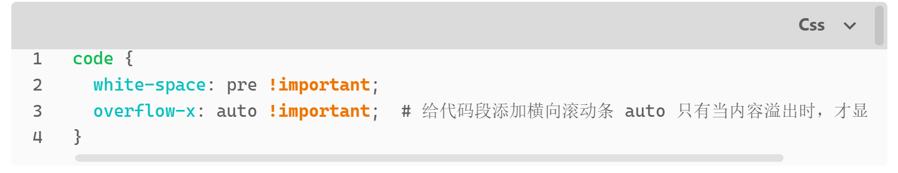

## 使用原则

这是我的 Obsidian 笔记，我将用这个管理工具记录我的编程知识，使用 Markdown 语法编写。

~~ps: 我喜欢 Markdown，语法看这里 [[markdown语法]]~~ 暂时无力维护，可以通过链接内网站自学语法。

---

**相关网页**
- [Obsidian 官网](https://obsidian.md/)
- [Obsidian 入门及进阶 + B站视频](https://www.bilibili.com/read/cv15035273)
- [Obsidian 插件推荐](https://zhuanlan.zhihu.com/p/353449575)
- [Obsidian 主题样式修改半入门教学](https://forum-zh.obsidian.md/t/topic/180)

---


### 1. **尽量使用文字而不是图片**  
   使用一段时间后发现，如果是图片并不是很方便。

### 2 . **引用网页的风险**  
   可以引用网页，但是存在链接失效的风险，所以遵循上一条原则，尽量使用文字 Markdown 格式。

### 3 . **图片排版统一**  
   图片排版尽量统一。

### 4. **页面初始标题**  
   以二级标题作为页面初始标题。

### 5. **PDF 文档引入**  
   ~~如果要引入 PDF 文档则引入时要有对应的页数形式如下~~  
   替代方案 [Pdf 阅读工具 PDF++ (必装)](obsidian%20插件篇.md#Pdf%20阅读工具%20PDF++%20(必装))  
   ```
   ![[《鸟哥的Linux私房菜-基础篇》第四版.pdf#page=593]]
   ```

### 6. **引入网页**  
   目前 Obsidian 默认支持外链形式，复制网址后默认为如下形式：  
   `[首次调用 API | DeepSeek API Docs](https://api-docs.deepseek.com/zh-cn/)`

### 7. **链接别名**  
   给链接取别名，示例：  
   `[[链接|别名]]`

### 8. **使用图片**  
   示例：  
   `![[图片名称]]`

### 9. **换行**  
```html
   <br></br> 或 <br/>
```

### 10. **目录结构**  
为了统一管理，除了最外层目录外，所有的次级目录如果内容多，则按照如下结构划分：  
```bash
    ├── 笔记
    │   └── 基本操作.md   // 存放笔记的位置，建议笔记最好有编号，方便排序
    ├── 附件
    │   ├── Pasted image 20211210163650.png   // 存放图片、音频、视频、PDF等文件位置
    │   └── Pasted image 20211210163741.png
    └── readme.md	    // 当前文件夹介绍内容   
```

### 11. **整理资料**  
由于前期资料收集太过随意，没有形成一个统一的风格，导致在查阅资料时十分不方便。  
而且不同的资料，收集的形式以及排版可能无法相同，有些是解释命令，有些则是解释概念。针对这一点，需要尽快改进，将在 Linux 章节内增加 Linux 命令章节，所有的命令全都按照字典序加入其中。

### 12. **关于总目录**  
最终发现总目录并没有什么用处，且需要花时间去维护，还不如使用搜索功能，所以去掉总目录。

### 13. **关于目录**  
目录其实也用处不大，可以通过左边侧边栏浏览，而且这个主要是为了自己用，所以也去掉。

### 14. **设置回收站、附件位置、图片链接格式、新笔记存放位置、检测所有类型文件**  
  
原本我是因为每次整理附件都要我自己主动整理，所以讨厌这种行为设置为统一的位置，其实 Obsidian 本身就支持自动处理。😓  
之后会对附件进行重新整理........

### 15. **内部链接方式，外部链接方式**  
**内部链接**： 使用双中括号 `[[ ]]` 来创建内部链接，例如 `[[文件名]]` 或 `[[文件名#标题]]`。如果需要别名，可以使用 `[[文件名|别名]]`。  

 **外部链接**：使用标准的 Markdown 链接语法 `[显示文本](URL)`，例如 `[百度](https://www.baidu.com)`。对于纯链接，可以直接写 URL，如 `https://www.baidu.com`。

### 16. **让笔记回归笔记**  
我在插件上做了太多的工作，导致越来越多的插件，越来越重的负担，反而丧失了笔记最初的初衷——总结，记录。  所以这一版本，我将尽量减少不需要的插件，只保留和笔记相关的必要插件。  
<font color="#ff0000">移除所有需要编程环境的插件，例如执行外部 shell 命令或 JupyterLab。</font>

### 17. **鼠标滚轮缩放设置**  


---

## 其他设置

### 1. **如何设置中文**  
   

### 2. **代码块添加横向滑动条**  
   配合插件 [Better codeblock （必装）](obsidian%20插件篇.md#Better%20codeblock%20（必装）)使用。  
   复制下面代码，创建 main.css 文件：  
   ```css
   code {
     white-space: pre !important;
     overflow-x: auto !important;  // 给代码段添加横向滚动条，auto 只有当内容溢出时，才显示滚动条。
   }
   ```

   点击 Obsidian 设置  
   ![[设置自定义样式.png|700]]  
   将 main.css 放入文件夹内，刷新即可。  
   配合插件 [better codeblock](obsidian%20插件篇.md#better%20codeblock) 一起使用。  
   **效果如下：**  
   

### 3. **使用 CSS 代码片段增强 Obsidian 视觉效果**  
   [使用 CSS 代码片段增强 Obsidian 视觉效果（一） | ReadingHere](https://www.readinghere.com/blog/using-css-snippets-to-enhance-obsidian-visuals-cn/)  
   目前并不需要，只是为之后的扩展位置留个备注。

### 4. **打开开发者模式**  
   ```
   快捷键 ctrl + shift + i
   ```

### 5. **外部附加资源**

- **Windows系统**

```powershell
# 管理员权限运行CMD/PowerShell 
mklink /D "D:\Obsidian库\外部资源" "E:\真实文件存储位置"

# 示例
mklink /D 'D:\obsidian\obsidian_programming_materials\资料'  'G:\资料'
```

- **参数解释**：
    - `/D`：创建目录符号链接（文件用`/H`创建硬链接）
    - 首路径：Obsidian库内的虚拟路径（自动生成空文件夹）
    - 末路径：外部真实文件路径

<span style="background:#b1ffff">mklink 创建的符号链接和 Windows 右键快捷方式有以下区别：</span>


- **创建方式**
    - **符号链接**：通过命令行使用 mklink 命令创建，如`mklink /D`用于创建目录符号链接。
    - **快捷方式**：可在选择的源文件或文件夹上鼠标右键，通过下拉菜单 “发送到”->“桌面 (创建快捷方式)” 创建，也可通过手动向导创建，命令行创建相对复杂。
- <font color="#ff0000">**系统层面的理解**</font>
    - **符号链接**：<span style="background:#b1ffff">是文件系统级别的链接，在文件系统中创建一个指针，指向实际文件或目录，操作系统会将符号链接当作实际文件或目录来处理</span>。
    - **快捷方式**：<span style="background:#b1ffff">是一种文件级别的链接，是一个包含目标路径的特殊文件，并不直接在文件系统层面映射目标文件，更多是为用户提供方便的入口。</span>
- **权限要求**
    - **符号链接**：通常需要管理员权限，Windows 10 之后可以启用开发者模式或者配置策略允许非管理员创建符号链接。
    - **快捷方式**：创建不需要管理员权限。
- **路径相关**
    - **符号链接**：支持相对路径解析，符号链接本身记录着所引用文件或目录的绝对或相对路径。
    - **快捷方式**：通常使用绝对路径，缺乏对相对路径的支持。
- **表现形式**
    - **符号链接**：显示为带有箭头的小图标，无扩展名或者统一为`.symlink`。
    - **快捷方式**：显示为带有箭头的小图标，扩展名为`.lnk`。
- **访问操作**
    - **符号链接**：命令行、程序和图形用户界面（GUI）都可以使用，很多操作仿佛直接操作符号链接的目标本身一样。
    - **快捷方式**：主要用于图形化界面，命令行工具无法将快捷方式视为目标本体那样进行操作，其他软件会认为快捷方式`.lnk`就是个普通文件。


## git 同步设置
利用 git 同步整个 obsidian 仓库，. gitignore 文件规则如下
```git
# 忽略整个.obsidian目录下的直接内容
.obsidian/

# 保留核心配置文件
!.obsidian/app.json
!.obsidian/appearance.json
!.obsidian/community-plugins.json
!.obsidian/core-plugins.json
!.obsidian/hotkeys.json
!.obsidian/graph.json

# 保留plugins目录及其子内容（但后续排除特定文件）
!.obsidian/plugins/
!.obsidian/plugins/**         # 递归包含所有子内容
# 单独忽略目标文件
.obsidian/plugins/recent-files-obsidian/data.json

# 保留其他目录
!.obsidian/icons/
!.obsidian/snippets/
!.obsidian/themes/


# other
temp/
tmp/*
资料/*
13 读书笔记/微信读书/*

# Ignore Smart Environment folder
.smart-env
.smtcmp_vector_db.tar.gz
.smtcmp_chat_histories/*


```

仍然保留 obsidian-pub-config 子模块，作为每个项目的初始化
