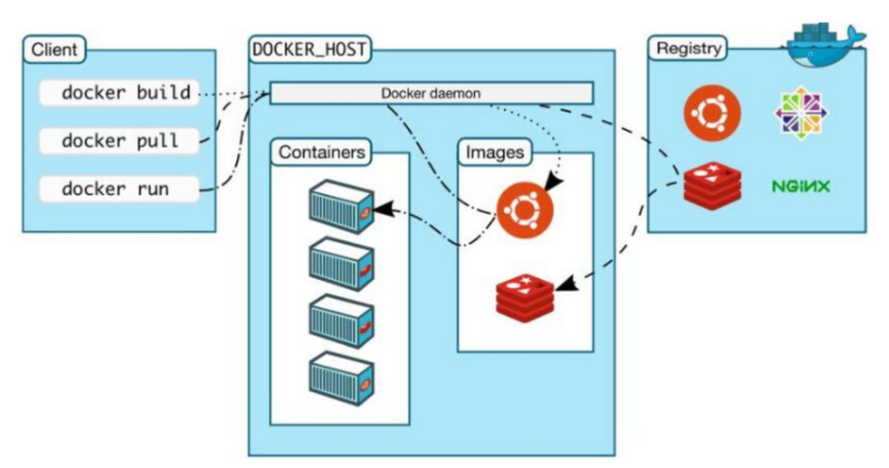

---
tags:
  - "#linux"
  - "#windows"
  - "#container"
---

## 简介
- 狂神说 B 站视频：[Docker学习大纲](https://www.bilibili.com/video/BV1og4y1q7M4?p=1)
- 学习笔记：
  - [Docker容器学习笔记一](https://blog.csdn.net/qq_41822345/article/details/107123094)
  - [Docker容器学习笔记二](https://blog.csdn.net/qq_41822345/article/details/107123141)
- 学习资源：[Docker 教程 | 菜鸟教程](https://www.runoob.com/docker/docker-tutorial.html)
- 实践平台：[Play with Docker](https://labs.play-with-docker.com/)

## 官方资源
- [docker官网](https://www.docker.com)
- [docker仓库](http://www.hub.docker.com/)
- [Docker Docs](https://docs.docker.com/)

## 安装
### 架构

### Linux
<!-- 待补充内容 -->

## 操作
<!-- 待补充内容 -->