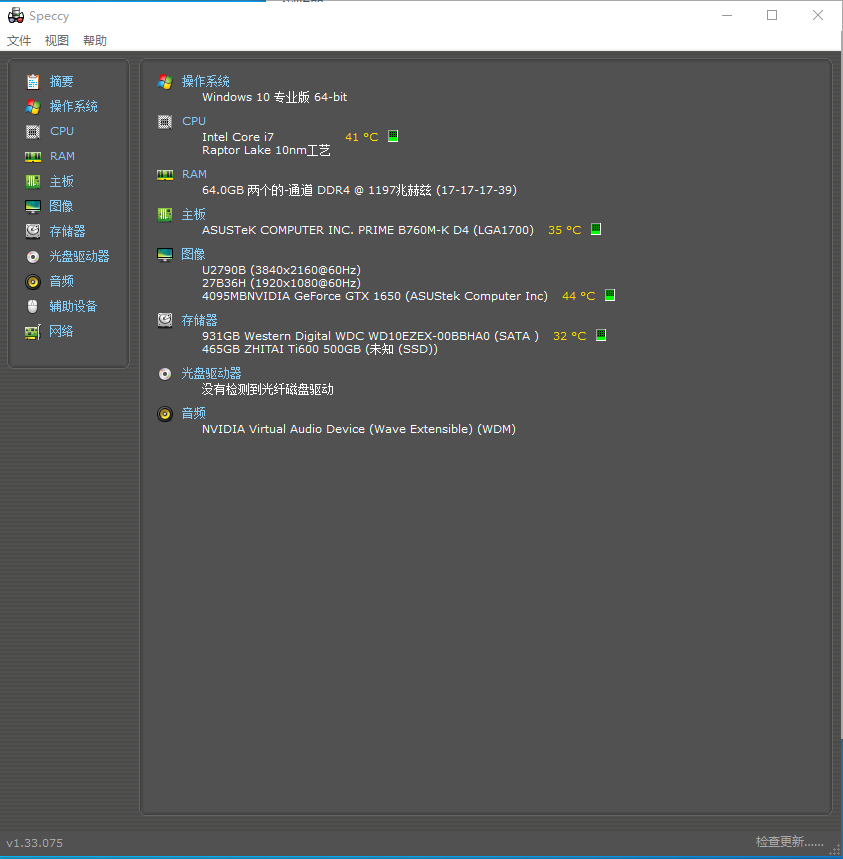

---
tags:
  - "#windows"
  - ai生成
---

## 通用

### VLC 播放器
- 简介：一款功能强大的多媒体播放器，支持多种音频和视频格式。
- 官网：[https://www.videolan.org/vlc/](https://www.videolan.org/vlc/)
- 特点：
    - 跨平台，可在 Windows、Mac、Linux 等系统使用。
    - 无需安装额外解码器即可播放多种格式文件。

### Everything
- 简介：一款快速搜索文件和文件夹的工具软件。
- 官网：[https://www.voidtools.com/](https://www.voidtools.com/)
- 特点：
    - 搜索速度极快，能瞬间定位文件。
    - 占用系统资源少。

### 7-Zip File Manager

- 简介：一款开源的文件压缩与解压缩工具。
- 官网：[https://www.7-zip.org/](https://www.7-zip.org/)
- 特点：
    - 支持多种压缩格式，压缩率较高。
    - 免费且无广告。

## 系统管理

### 雪藏HsFreezer

- 简介：
- 官网：
- 下载地址:
- 特点：
    - 
    - 

### WizTree
- 简介：一款用于快速分析磁盘空间使用情况的软件。
- 官网：[https://wiztreefree.com/](https://wiztreefree.com/)
- 特点：
    - 扫描速度快，能迅速呈现磁盘空间占用详情。
    - 可视化界面，直观展示结果。

### Speccy

  

- 简介：用于查看计算机系统相关属性信息的功能或工具。
- 官网：[CCleaner 让您的计算机更快速、更安全 | 官方网站](https://www.ccleaner.com/zh-cn)
- 下载地址: [Speccy — 免费下载](https://www.ccleaner.com/zh-cn/speccy/download)
- 特点：
    - 可快速获取系统基本信息，如系统版本、处理器等。
    - 操作简便，系统自带。

## 远程桌面

### ToDesk
- 简介：一款远程控制软件，可实现远程办公等操作。
- 官网：[https://www.todesk.com/](https://www.todesk.com/
- 特点：
    - 连接稳定，远程控制流畅。
    - 支持多种设备间的远程连接。

### 向日葵远程控制

- 简介：
- 官网：
- 下载地址:
- 特点：
    - 
    - 

## 阅读与笔记

### Meld

- 简介：
- 官网：
- 下载地址:
- 特点：
    - 
    - 

### O-lib

- 简介：
- 官网：
- 下载地址:
- 特点：
    - 
    - 

### Obsidian

- 简介：
- 官网：
- 下载地址:
- 特点：
    - 
	-

### Follow

- 简介：
- 官网：
- 下载地址:
- 特点：
    - 
    - 

### Wireshark

- 简介：一款网络协议分析工具，用于捕获和分析网络数据包。
- 官网：[https://www.wireshark.org/](https://www.wireshark.org/)
- 特点：
    - 支持众多网络协议的分析。
    - 开源且功能强大。

### Sheas - Cealer

- 简介：图中信息有限，无法准确介绍。
- 官网：无（图中未显示）
- 特点：无（图中未显示）
- 备注：图中信息不足，难以详细说明。

## 编程辅助工具 
### XTerminal

- 简介：
- 官网：
- 下载地址:
- 特点：
    - 
    - 

### AmaoComV 4.9

- 简介：
- 官网：
- 下载地址:
- 特点：
    - 
    - 

### Apifox

- 简介：
- 官网：
- 下载地址:
- 特点：
    - 
    - 

### Chat 2 DB Pro

- 简介：
- 官网：
- 下载地址:
- 特点：
    - 
    - 

### Ollama

- 简介：
- 官网：
- 下载地址:
- 特点：
    - 

### Enigma Virtual Box

- **简介**：Enigma Virtual Box 是一款免费的软件虚拟化工具。它可以将多个文件封装到应用程序主文件中，把程序和配套文件打包成一个可执行文件，制作成为单执行文件的绿色软件。支持所有类型的文件格式，如动态链接库\*. dll、ActiveX/COM\*. dll,\*. ocx、视频/音频文件\*. avi,\*. mp 3、文本文件\*. txt,\*. doc 等。
- **官网**
    - **中文官网**：https://enigmaprotector.cn/cn/downloads.html
    - **英文官网**：https://enigmaprotector.com/en/downloads.html
- **下载地址**：可从[中文官网](https://enigmaprotector.cn/cn/downloads.html)或[英文官网](https://enigmaprotector.com/en/downloads.html)进行下载，也可直接点击[https://enigmaprotector.com/assets/files/enigmavb.exe](https://enigmaprotector.com/assets/files/enigmavb.exe)进行下载。
- **特点**
    - **广泛的文件支持**：支持各种类型的文件进行虚拟打包，无论是程序文件、库文件、多媒体文件还是文档文件等都能轻松处理。
    - **无临时文件释放**：不会释放临时文件到计算机，也不会将打包文件释放至硬盘，所有文件模拟过程仅在内存运行，有效保护用户隐私和系统整洁。
    - **跨平台兼容**：支持 x 86（32 位）和 x 64（64 位）文件，打包后的程序能在 Windows 2000/XP/2003/Vista/2008、Windows 7、Windows 10 等广泛的 Windows 操作系统中运行。
    - **文件压缩功能**：支持文件的压缩，可大幅减少生成文件的体积，便于软件的分发和存储。
    - **使用简单方便**：不需要懂得额外的编程代码，只需运行该工具，浏览选择需要打包的文件，添加到打包目录列表中，最后点击打包即可完成操作。
    - **完全免费**：是一个完全免费的程序，不需要付费注册，为用户提供了经济高效的文件封装解决方案。

