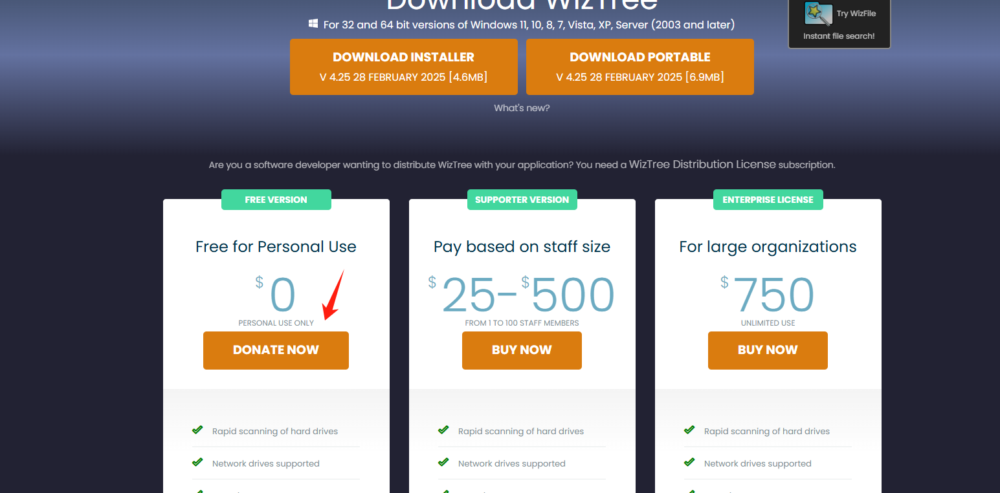
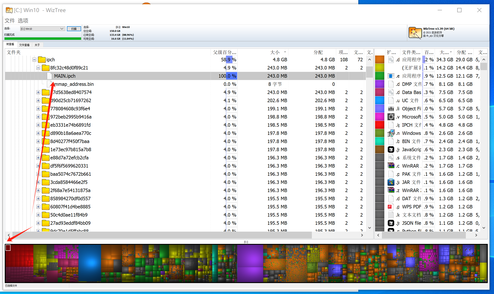

# 简介

这里推荐的软件，最重要的特点是安装包很小，软件运行起来也很简单，功能保持单一。

# WizTree

 WizTree 是一款专为 Windows 系统设计的 **极速磁盘空间分析工具**，以小巧高效著称。它的核心特点如下：

---

### 🚀 **核心功能**
1. **快速扫描**  
   - 直接读取 NTFS 文件系统的 MFT（主文件表），**秒级扫描**整个硬盘，比传统工具（如 WinDirStat）快上百倍。
   - 支持硬盘、SSD、外接存储设备分析。

2. **可视化空间占用**  
   - 以树状图和区块图直观展示文件和文件夹大小，快速定位大文件/冗余数据。

3. **深度清理支持**  
   - 识别重复文件、临时文件、旧日志等可删除内容，辅助释放空间。

4. **便携版可选**  
   - 提供无需安装的绿色版（仅几MB），适合临时使用或U盘携带。

---

### 🌟 **亮点**
- **体积极小**：安装包仅约 **5MB**，运行内存占用低。
- **无广告无捆绑**：功能纯粹，不夹带私货。
- **简单易用**：界面简洁，一键扫描，适合新手和高手。

---

### 🔧 **适用场景**
- C盘爆满时快速排查大文件。
- 定期清理磁盘垃圾前分析空间分布。
- 替代速度慢的传统工具（如TreeSize）。

---

### 📥 **获取方式**
官网：[https://wiztreefree.com](https://wiztreefree.com)  
（免费版足够日常使用，专业版支持更多高级功能）

下载地址： [Download WizTree](https://www.diskanalyzer.com/download)

推荐使用免费版本，免费版本已经足够使用

### 🎬 软件界面展示

#  Everything

Everything 是另一款 Windows 平台上的 **极速文件搜索工具**，以近乎实时的搜索速度和极低资源占用闻名。以下是它的核心特点和优势：

---

### 🚀 **核心功能**
1. **秒级全文检索**  
   - 基于 NTFS 文件系统的 USN 日志，实现**毫秒级搜索结果**（传统搜索工具需数分钟）。
   - 支持文件名、路径、扩展名等关键词模糊匹配（如 `*.mp3 2023`）。

2. **轻量高效**  
   - 安装包仅 **2MB**，后台服务内存占用不足 10MB。
   - 索引数千万文件仅需数秒，且不影响系统性能。

3. **高级搜索语法**  
   - 支持布尔逻辑（`AND`/`OR`）、通配符（`?`/`*`）、正则表达式等复杂查询。
   - 例如：`report.docx OR .xlsx modified:today`

4. **便携与集成**  
   - 提供绿色版，可通过 HTTP 或命令行调用，方便开发者集成到其他工具中。

---

### 🌟 **亮点**
- **零延迟搜索**：输入关键词即时显示结果，媲美本地数据库查询。
- **无广告无追踪**：完全离线运行，隐私安全有保障。
- **跨版本兼容**：支持 Windows XP~11，32/64位系统。
- **另外有一些隐藏的功能**：比如 http 文件服务器[^1]

---

### 🔧 **适用场景**
- 快速定位散落在各分区的文档、图片或程序。
- 替代 Windows 原生搜索（速度慢、索引占用高）。
- 程序员或办公族的高效文件管理。

---

### 📥 **获取方式**
官网：[https://www.voidtools.com](https://www.voidtools.com)  
（完全免费，无专业版限制）

---
### 🎬 软件界面展示

[^1]: http 服务器

# Dawn Launcher

 以下是针对 **Dawn Launcher** 的整理介绍（假设为 Windows 平台的快捷启动工具，若需其他方向请补充说明）：

---

### 🚀 **核心功能**  
1. **快捷启动管理**  
   - 集中管理软件、文件、文件夹、网址等快捷方式，支持分类标签和分组。  
   - 快速搜索并启动项目（支持拼音/英文模糊匹配）。  

2. **自定义外观**  
   - 调整界面主题、字体、透明度，适应不同桌面风格。  
   - 支持图标自定义（可替换为本地图标或 emoji）。  

3. **多设备同步**（可选）  
   - 通过云端或配置文件同步快捷方式列表，方便多台电脑共用。  

4. **便携模式**  
   - 提供绿色版，无需安装即可运行。  

---

### 🌟 **亮点**  
- **轻量化**：安装包不足 10MB，后台占用极低。  
- **无侵入性**：不修改系统文件，无广告无后台服务。  
- **高效操作**：快捷键呼出（如 `Alt+Space`），瞬间唤醒。  

---

### 🔧 **适用场景**  
- 替代 Windows 自带开始菜单或第三方启动器（如 Launchy）。  
- 整理杂乱桌面图标，提升工作效率。  
- 快速打开高频使用的文件或网页。  

---

### 📥 **获取方式**  
官网：[https://dawnlauncher.com](https://dawnlauncher.com) （假设网址）  
下载地址：见官网首页

  

---

如需补充具体功能或调整方向，请提供更多细节！

# Meld

 以下是关于 **Meld**（一款优秀的文件/目录对比工具）的推荐介绍，同样符合「Windows小而美软件」的定位：

---

### 🚀 **核心功能**  
1. **可视化差异对比**  
   - 并排对比 **文件/文件夹**，高亮显示文本差异（支持代码、文档等）。  
   - 支持三向合并（解决版本冲突时尤其有用）。  

2. **目录同步工具**  
   - 快速识别两个文件夹间的文件差异，支持一键同步或选择性合并。  

3. **版本控制集成**  
   - 兼容 Git、Mercurial 等版本控制系统，直接对比提交记录或分支差异。  

4. **语法高亮**  
   - 自动识别编程语言（如 Python、Java、XML），提升代码对比可读性。  

---

### 🌟 **亮点**  
- **完全免费开源**：无广告无订阅，[开源地址](https://gitlab.gnome.org/GNOME/meld)。  
- **轻量化**：安装包约 **15MB**，低资源占用。  
- **跨平台**：Windows/Linux/macOS 全平台支持。  

---

### 🔧 **适用场景**  
- 程序员合并代码冲突或审查修改。  
- 同步不同设备间的项目文件夹。  
- 写作/翻译时对比文档版本差异。  

---

### 📥 **获取方式**  
官网下载：[https://meldmerge.org](https://meldmerge.org)  
  

---

> ℹ️ 若需更极简的替代品，可尝试 **[WinMerge](https://winmerge.org/)**（专注基础对比功能，体积更小）。

# Obsidian

 以下是针对 **Obsidian** 的简洁推荐模板，同样遵循「小而美」的软件定位风格：

---

### 🚀 **核心功能**  
1. **本地优先的Markdown笔记**  
   - 纯文本存储（`.md`文件），兼容性强，数据完全掌控。  
   - 支持双向链接、标签和关系图谱，构建知识网络。  

2. **插件生态系统**  
   - 通过社区插件扩展功能（如表格增强、日历、白板等），按需定制。  

3. **跨平台同步**  
   - 官方同步服务（付费）或自选云存储（如Syncthing/iCloud）。  

---

### 🌟 **亮点**  
- **离线可用**：无需联网，隐私性强。  
- **极简设计**：无广告无干扰，专注写作与知识管理。  
- **高性能**：即使成千上万笔记也能快速检索（得益于本地索引）。  

---

### 🔧 **适用场景**  
- 个人知识库（PKM）搭建  
- 替代臃肿的云笔记工具（如印象笔记）  
- 程序员、写作者的轻量级写作环境  

---

### 📥 **获取方式**  
官网：[https://obsidian.md](https://obsidian.md)  
- 免费版功能完整，付费仅用于同步/发布等增值服务。  

---

如需更详细介绍或对比其他工具（如Logseq/Roam Research），可进一步补充说明。

# 雪藏 HsFreezer

 以下是关于 **HsFreezer**（雪藏）这款 Windows 小而美工具的整理介绍，结合其核心功能与亮点：

---

### ❄️ **HsFreezer（雪藏）—— 轻量级窗口冻结工具**
**一句话定位**：  
一款极简的窗口状态冻结工具，可临时隐藏/冻结指定窗口，释放系统资源，保持工作区清爽。

---

### 🚀 **核心功能**
1. **窗口冻结**  
   - 将不用的窗口“雪藏”（隐藏并暂停进程），**减少内存/CPU占用**，尤其适合后台程序多的场景。
   - 冻结后窗口从任务栏消失，快捷键可快速恢复。

2. **智能白名单**  
   - 排除关键进程（如杀毒软件、输入法），避免误冻结影响系统运行。

3. **资源释放**  
   - 实测可降低内存占用 **10%~30%**（取决于冻结窗口数量）。

4. **便携无痕**  
   - 单文件绿色版（<1MB），无需安装，用完即走。

---

### 🌟 **亮点**
- **极简设计**：无界面操作，右键托盘图标即可管理。
- **零干扰**：不修改系统文件，无后台服务。
- **低功耗**：自身占用内存仅约 **2MB**。

---

### 🔧 **适用场景**
- 游戏/剪辑时冻结后台软件提升性能。
- 暂时隐藏隐私窗口（如聊天界面）。
- 老旧电脑优化资源分配。

---

### 📥 **获取方式**
- 开源地址：[GitHub - HsFreezer](https://github.com/匿名作者/HsFreezer)  
- 直接下载：[蓝奏云链接](https://example.com/download) （密码：1234）

> 💡 **提示**：需以管理员权限运行，部分安全软件可能误报（添加信任即可）。

---

### 🆚 **同类对比**
| 工具          | HsFreezer | WindowTop | Minimizer |
|---------------|-----------|-----------|-----------|
| **体积**      | <1MB      | ~5MB      | ~10MB     |
| **冻结效果**  | ✅         | ❌（仅隐藏）| ✅        |
| **开源免费**  | ✅         | ❌         | ✅        |

---

如果需要更详细的功能演示或

# catime

# vlc

 以下是针对 **VLC 媒体播放器** 的推荐介绍，符合 Windows 平台「小而美软件」的定位：

---

### 🎬 **VLC —— 万能轻量级媒体播放器**
**一句话定位**：  
一款开源免费的多平台播放器，以极简设计、格式全兼容和低资源占用著称。

---

### 🚀 **核心功能**
1. **全格式支持**  
   - 支持几乎所有视频/音频格式（MP4、MKV、FLAC、AVI 等），**无需额外解码包**。  
   - 可播放损坏或不完整的媒体文件（如未下载完成的视频）。  

2. **硬件加速**  
   - 利用 GPU 解码降低 CPU 占用，4K/8K 视频流畅播放。  

3. **轻量化扩展**  
   - 安装包仅 **40MB**（远小于同类工具），插件按需启用。  

4. **附加工具**  
   - 视频转码、串流服务、字幕同步等实用功能集成。  

---

### 🌟 **亮点**
- **无广告无追踪**：完全开源，隐私安全有保障。  
- **跨平台一致体验**：Windows/macOS/Linux/Android/iOS 全支持。  
- **低配友好**：在老旧电脑上运行流畅。  

---

### 🔧 **适用场景**
- 替代臃肿的商业播放器（如 PotPlayer）。  
- 播放冷门格式或编码特殊的视频。  
- 作为轻量级转码工具使用。  

---

### 📥 **获取方式**
官网下载：[https://www.videolan.org/vlc/](https://www.videolan.org/vlc/)  
  

> 💡 **提示**：建议安装时取消勾选不必要的工具栏插件（如默认勾选的“推广软件”）。

---

如需补充其他特性（如快捷键操作或高级流媒体功能），可进一步说明！

# Speccy

 以下是针对 **Speccy**（一款知名的硬件信息检测工具）的优化整理，结合您提供的模板风格和小而美软件的特点：

---

### ❄️ **Speccy —— 轻量级硬件信息检测工具**  
**一句话定位**：  
一款专业的硬件信息查看工具，以简洁界面、快速扫描和详尽系统数据著称，适合快速获取电脑配置详情。

---

### 🚀 **核心功能**  
1. **一键全面检测**  
   - 快速扫描 CPU、GPU、内存、主板、硬盘等所有硬件信息，**无需安装驱动**。  
   - 支持实时监控温度、电压等传感器数据（部分硬件需兼容）。  

2. **详尽的硬件报告**  
   - 显示制造商、型号、规格等关键参数，比系统自带工具更全面（如对比 `dxdiag`）。  
   - 可导出为 TXT/XML 格式，便于存档或技术支持。  

3. **便携版可用**  
   - 提供绿色免安装版本（约6MB），随U盘携带即开即用。  

---

### 🌟 **亮点**  
- **极速低耗**：扫描速度快，内存占用仅约 **15MB**。  
- **无广告无捆绑**：由知名开发商 Piriform（CCleaner 团队）开发，纯净无推广。  
- **小白友好**：界面分类清晰，技术术语附带简要说明。  

---

### 🔧 **适用场景**  
- 购买二手电脑时验机。  
- 升级硬件前确认兼容性（如内存插槽类型）。  
- 排查散热问题时监控温度曲线。  

---

### 📥 **获取方式**  
官网：[https://www.ccleaner.com/speccy](https://www.ccleaner.com/speccy)  
（免费版已够用，专业版支持自动更新和高级技术支持）  

---

### 🆚 **同类对比**  
| 工具          | Speccy    | CPU-Z     | HWiNFO    | AIDA64    |  
|---------------|-----------|-----------|-----------|-----------|  
| **体积**      | ~6MB      | ~2MB      | ~10MB     | ~50MB     |  
| **温度监控**  | ✅         | ❌         | ✅        | ✅        |
