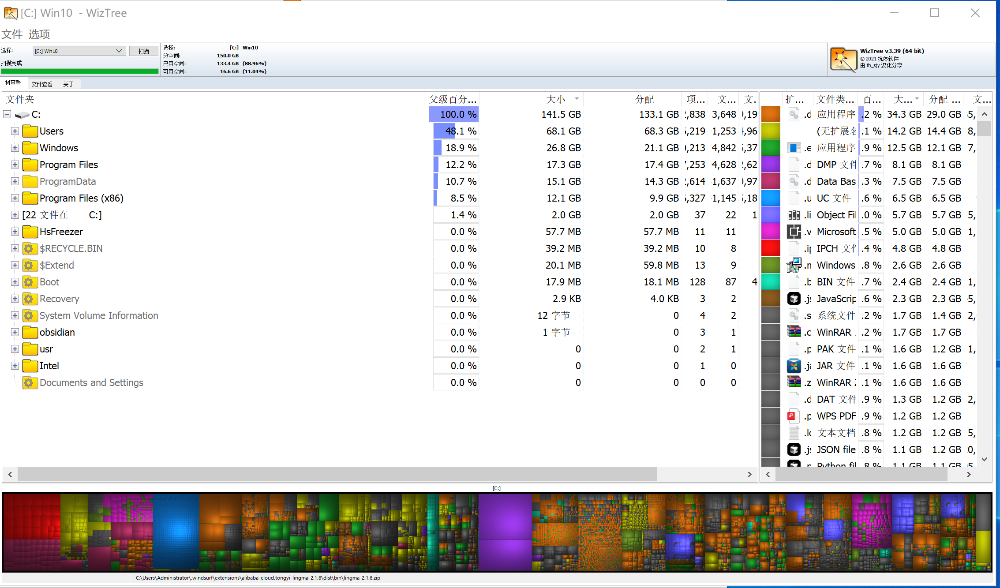
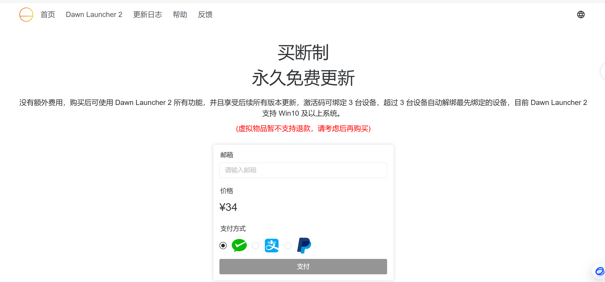
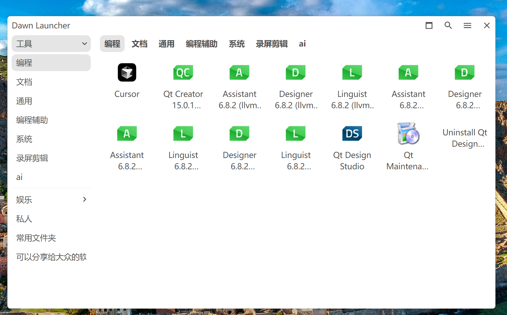
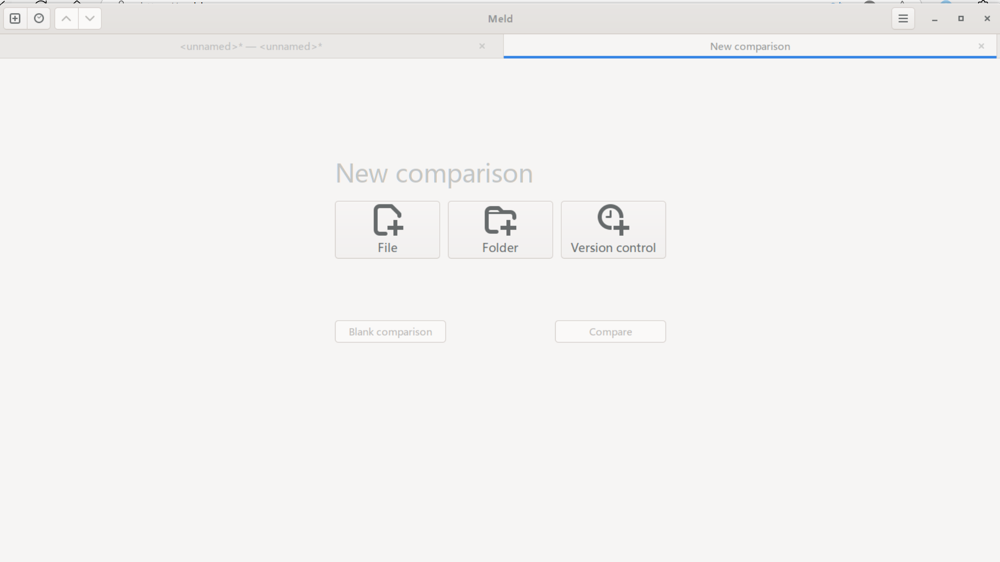
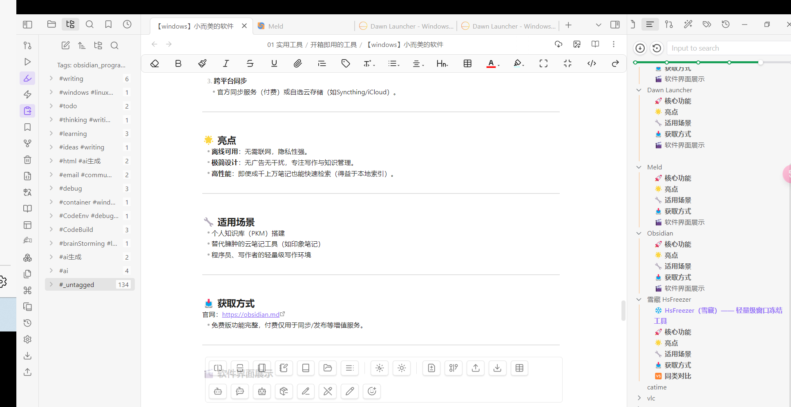

# 简介

这里推荐的软件遵循「小即是美」原则：
- ✅ **轻量级**：安装包≤100 MB，低资源占用  
- ✅ **功能专注**：解决单一需求不臃肿  
- ✅ **即装即用**：无需复杂配置  
- ✅ **免费/开源优选**：拒绝广告与捆绑  

### 🛠️ 推荐列表
1. **WizTree** - 极速磁盘分析（5 MB）  
2. **Everything** - 毫秒级文件搜索（2 MB）  
3. **Dawn Launcher** - 快捷启动器（100 MB）  
4. **Meld** - 文件对比工具（28 MB）  
5. **Obsidian** - 本地笔记管理  
6. **VLC** - 全格式播放器（40 MB）  
7. **Speccy** - 硬件检测工具  
8. **Catime** - 极简计时器（2 MB）  
9. **HsFreezer** - 窗口冻结工具（1 MB）  

# WizTree

 WizTree 是一款专为 Windows 系统设计的 **极速磁盘空间分析工具**，以小巧高效著称。它的核心特点如下：

---

### 🚀 **核心功能**
1. **快速扫描**  
   - 直接读取 NTFS 文件系统的 MFT（主文件表），**秒级扫描**整个硬盘，比传统工具（如 WinDirStat）快上百倍。
   - 支持硬盘、SSD、外接存储设备分析。

2. **可视化空间占用**  
   - 以树状图和区块图直观展示文件和文件夹大小，快速定位大文件/冗余数据。

3. **深度清理支持**  
   - 识别重复文件、临时文件、旧日志等可删除内容，辅助释放空间。

4. **便携版可选**  
   - 提供无需安装的绿色版（仅几MB），适合临时使用或U盘携带。

---

### 🌟 **亮点**
- **体积极小**：安装包仅约 **5MB**，运行内存占用低。
- **无广告无捆绑**：功能纯粹，不夹带私货。
- **简单易用**：界面简洁，一键扫描，适合新手和高手。

---

### 🔧 **适用场景**
- C盘爆满时快速排查大文件。
- 定期清理磁盘垃圾前分析空间分布。
- 替代速度慢的传统工具（如TreeSize）。

---

### 📥 **获取方式**
官网：[https://wiztreefree.com](https://wiztreefree.com)  
（免费版足够日常使用，专业版支持更多高级功能）

推荐使用免费版本，免费版本已经足够使用

### 🎬 软件界面展示

# Everything

Everything 是另一款 Windows 平台上的 **极速文件搜索工具**，以近乎实时的搜索速度和极低资源占用闻名。以下是它的核心特点和优势：

---

### 🚀 **核心功能**
1. **秒级全文检索**  
   - 基于 NTFS 文件系统的 USN 日志，实现**毫秒级搜索结果**（传统搜索工具需数分钟）。
   - 支持文件名、路径、扩展名等关键词模糊匹配（如 `*.mp3 2023`）。

2. **轻量高效**  
   - 安装包仅 **2MB**，后台服务内存占用不足 10MB。
   - 索引数千万文件仅需数秒，且不影响系统性能。

3. **高级搜索语法**  
   - 支持布尔逻辑（`AND`/`OR`）、通配符（`?`/`*`）、正则表达式等复杂查询。
   - 例如：`report.docx OR .xlsx modified:today`

4. **便携与集成**  
   - 提供绿色版，可通过 HTTP 或命令行调用，方便开发者集成到其他工具中。

---

### 🌟 **亮点**
- **零延迟搜索**：输入关键词即时显示结果，媲美本地数据库查询。
- **无广告无追踪**：完全离线运行，隐私安全有保障。
- **跨版本兼容**：支持 Windows XP~11，32/64位系统。
- **另外有一些隐藏的功能**：比如 http 文件服务器[^1]

---

### 🔧 **适用场景**
- 快速定位散落在各分区的文档、图片或程序。
- 替代 Windows 原生搜索（速度慢、索引占用高）。
- 程序员或办公族的高效文件管理。

---

### 📥 **获取方式**
官网：[https://www.voidtools.com](https://www.voidtools.com)  
（完全免费，无专业版限制）

---
### 🎬 软件界面展示

[^1]: http 服务器

# Dawn Launcher

### 🚀 **核心功能**
1. **快捷启动管理**  
   - 集中管理软件、文件、文件夹、网址等快捷方式，支持分类标签和分组。  
   - 快速搜索并启动项目（支持拼音/英文模糊匹配）。  

2. **自定义外观**  
   - 调整界面主题、字体、透明度，适应不同桌面风格。  
   - 支持图标自定义（可替换为本地图标或 emoji）。  

3. **免费开源**
  -  Dawn Launcher1版本为开源免费版本，基本功能以及完备满足，可直接使用该版本
  -  Dawn Launcher2 版本为收费版本，作者承诺34元永久免费更新，个人觉得可以支持一下作者

---

### 🌟 **亮点**
- **轻量化**：安装包不足 100 MB，后台占用低。  
- **无侵入性**：不修改系统文件，无广告无后台服务。  
- **高效操作**：快捷键呼出（如 `Alt+Space`），瞬间唤醒。  （本人设置为ctrl+p 为了防止和豆包冲突）

---

### 🔧 **适用场景**
- 替代 Windows 自带开始菜单或第三方启动器（如 Launchy）。  
- 整理杂乱桌面图标，提升工作效率。  
- 快速打开高频使用的文件或网页。  

---

### 📥 **获取方式**
官网：[https://dawnlauncher.com](https://dawnlauncher.com) 
下载地址：见官网首页，分为

---

### 🎬 软件界面展示

# Meld

### 🚀 **核心功能**
1. **可视化差异对比**  
   - 并排对比 **文件/文件夹**，高亮显示文本差异（支持代码、文档等）。  
   - 支持三向合并（解决版本冲突时尤其有用）。  

2. **目录同步工具**  
   - 快速识别两个文件夹间的文件差异，支持一键同步或选择性合并。  

3. **版本控制集成**  
   - 兼容 Git、Mercurial 等版本控制系统，直接对比提交记录或分支差异。  

4. **语法高亮**  
   - 自动识别编程语言（如 Python、Java、XML），提升代码对比可读性。  

---

### 🌟 **亮点**
- **完全免费开源**：无广告无订阅。  
- **轻量化**：安装包约 **28MB**，低资源占用。  
- **跨平台**：Windows/Linux/macOS 全平台支持。  

---

### 🔧 **适用场景**
- 程序员合并代码冲突或审查修改。  
- 同步不同设备间的项目文件夹。  
- 写作/翻译时对比文档版本差异。  

---

### 📥 **获取方式**
官网下载：[https://meldmerge.org](https://meldmerge.org)  

---

### 🎬 软件界面展示

# Obsidian

### 🚀 **核心功能**
1. **本地优先的Markdown笔记**  
   - 纯文本存储（`.md`文件），兼容性强，数据完全掌控。  
   - 支持双向链接、标签和关系图谱，构建知识网络。  

2. **插件生态系统**  
   - 通过社区插件扩展功能（如表格增强、日历、白板等），按需定制。  

3. **跨平台同步**  
   - 官方同步服务（付费）或自选云存储（如Syncthing/iCloud）。  

---

### 🌟 **亮点**
- **离线可用**：无需联网，隐私性强。  
- **极简设计**：无广告无干扰，专注写作与知识管理。  
- **高性能**：即使成千上万笔记也能快速检索（得益于本地索引）。  

---

### 🔧 **适用场景**
- 个人知识库（PKM）搭建  
- 替代臃肿的云笔记工具（如印象笔记）  
- 程序员、写作者的轻量级写作环境  

---

### 📥 **获取方式**
官网：[https://obsidian.md](https://obsidian.md)  
- 免费版功能完整，付费仅用于同步/发布等增值服务。  

--- 

### 🎬 软件界面展示

# vlc

一款开源免费的多平台播放器，以极简设计、格式全兼容和低资源占用著称。

---

### 🚀 **核心功能**
1. **全格式支持**  
   - 支持几乎所有视频/音频格式（MP4、MKV、FLAC、AVI 等），**无需额外解码包**。  
   
2. **硬件加速**  
   - 利用 GPU 解码降低 CPU 占用，4K/8K 视频流畅播放。  

3. **轻量化扩展**  
   - 安装包仅 **40MB**（远小于同类工具），插件按需启用。  

4. **附加工具**  
   - 视频转码、串流服务、字幕同步等实用功能集成。  

---

### 🌟 **亮点**
- **无广告无追踪**：完全开源，隐私安全有保障。  
- **跨平台一致体验**：Windows/macOS/Linux/Android/iOS 全支持。  
- **低配友好**：在老旧电脑上运行流畅。  

---

### 🔧 **适用场景**
- 替代臃肿的商业播放器（如 PotPlayer）。  
- 播放冷门格式或编码特殊的视频。  
- 作为轻量级转码工具使用。  

---

### 📥 **获取方式**
官网下载：[https://www.videolan.org/vlc/](https://www.videolan.org/vlc/)  

### 🎬 软件界面展示

# Speccy

一款专业的硬件信息查看工具，以简洁界面、快速扫描和详尽系统数据著称，适合快速获取电脑配置详情。

---

### 🚀 **核心功能**
1. **一键全面检测**  
   - 快速扫描 CPU、GPU、内存、主板、硬盘等所有硬件信息，**无需安装驱动**。  
   - 支持实时监控温度、电压等传感器数据（部分硬件需兼容）。  

2. **详尽的硬件报告**  
   - 显示制造商、型号、规格等关键参数，比系统自带工具更全面（如对比 `dxdiag`）。  
   - 可导出为 TXT/XML 格式，便于存档或技术支持。  

3. **便携版可用**  
   - 提供绿色免安装版本（约6MB），随U盘携带即开即用。  

---

### 🌟 **亮点**
- **极速低耗**：扫描速度快，内存占用仅约 **15MB**。  
- **无广告无捆绑**：由知名开发商 Piriform（CCleaner 团队）开发，纯净无推广。  
- **小白友好**：界面分类清晰，技术术语附带简要说明。  

---

### 🔧 **适用场景**
- 购买二手电脑时验机。  
- 升级硬件前确认兼容性（如内存插槽类型）。  
- 排查散热问题时监控温度曲线。  

---

### 📥 **获取方式**
官网：[https://www.ccleaner.com/speccy](https://www.ccleaner.com/speccy)  
（免费版已够用，专业版支持自动更新和高级技术支持）  

---
### 🎬 软件界面展示

# catime
	一款简洁的 Windows 倒计时工具，支持番茄时钟功能，具有透明界面和丰富的自定义选项。

### 🚀 **核心功能**
- **极简设计**: 透明界面、点击穿透、随意拖拽和缩放、没有繁琐的图形化设置界面，不会让人有直观上多开一个软件的感觉
- **灵活计时**: 快速预设、自定义时间输入、显示当前时间(12/24小时制)、倒计时、正计时、番茄时钟
- **超时动作**: 显示消息、显示当前时间、正计时、锁定屏幕、打开文件/软件、打开网站、关机、重启
- **自定义丰富**: 47种字体、15种预设颜色、支持输入颜色值、使用调色板选择颜色、支持实时预览

### 🌟 **亮点**
- 简单 轻巧 软件大小2MB左右
- 资源占用小，功能自定义灵活，方便
### 🔧 **适用场景**
- 👔 下班倒计时
- 🍅 番茄时钟
- 🎮 打游戏时使用，可以随时看时间，避免玩过头
- ⏰ 定时打开
    - 🌐 网站
    - 💻 软件
    - 📄 文件
    - 📝 批处理脚本
    - 🔄 定时关机/重启
- 📊 ppt演示倒计时
- 🕰️ 作为桌面时钟使用
- ⏱️正计时/倒计时

演示视频(基于V1.0.5)： [BiliBili](https://www.bilibili.com/video/BV1fzQRYxErt)

### 📥 **获取方式**
- 开源地址 [Catime/README.md at main · vladelaina/Catime](https://github.com/vladelaina/Catime/blob/main/README.md)

---
### 🎬 软件界面展示

# 雪藏 HsFreezer

一款极简的窗口状态冻结工具，可临时隐藏/冻结指定窗口，释放系统资源，保持工作区清爽。

---

### 🚀 **核心功能**
1. **窗口冻结**  
   - 将不用的窗口“雪藏”（隐藏并暂停进程），**减少内存/CPU占用**，尤其适合后台程序多的场景。
   - 冻结后窗口从任务栏消失，快捷键可快速恢复。

2. **智能白名单**  
   - 排除关键进程（如杀毒软件、输入法），避免误冻结影响系统运行。

3. **资源释放**  
   - 实测可降低内存占用 **10%~30%**（取决于冻结窗口数量）。

4. **便携无痕**  
   - 单文件绿色版（<1MB），无需安装，用完即走。

---

### 🌟 **亮点**
- **极简设计**：无界面操作，右键托盘图标即可管理。
- **零干扰**：不修改系统文件，无后台服务。

---

### 🔧 **适用场景**
- 游戏/剪辑时冻结后台软件提升性能。
- 暂时隐藏隐私窗口（如聊天界面）。
- 老旧电脑优化资源分配。

---

### 📥 **获取方式**
- 开源地址：[superDMS/HsFreezer-Hidden-in-the-snow-: 雪藏HsFreezer是一款调度计算机资源的进程管理软件 and 游戏暂停冻结软件 and 老板键平替软件 and .....自定义软件)](https://github.com/superDMS/HsFreezer-Hidden-in-the-snow-)

- gitee: [雪藏HsFreezer-Hidden-in-the-snow: 雪藏HsFreezer 游戏冻结器 ---2.21 陌光助理上线!欢迎体验 Automatic update:*---*frp-oil.top:36409*---*frp-oil.top:18884*---* ---111---](https://gitee.com/damodms/hs-freezer-hidden-in-the-snow)
### 🎬 软件界面展示
