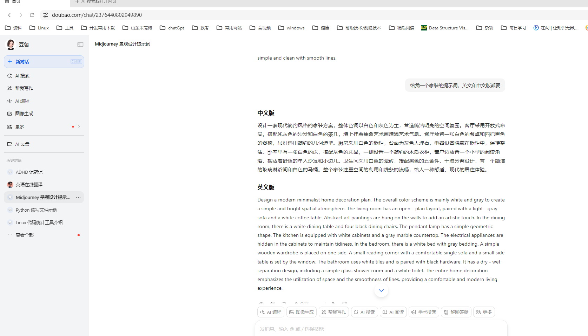

平台：[揽睿星舟-云端GPU，AI训练推理算力平台，开箱即用的AI应用，揽睿星舟，高性价比之选](https://lanrui.co/)

初级用法

先选择应用版试试

选择真实感，

填写英文提示词，点击运行

快启动的成本大概是 0.38 元一张图，100 points 是 1 元

生成的效果图及提示词如下
### 中文版 
设计一套现代简约风格的家装方案，整体色调以白色和灰色为主，营造简洁明亮的空间氛围。客厅采用开放式布局，搭配浅灰色的沙发和白色的茶几，墙上挂着抽象艺术画增添艺术气息。餐厅放置一张白色的餐桌和四把黑色的餐椅，吊灯选用简约的几何造型。厨房采用白色的橱柜，台面为灰色大理石，电器设备隐藏在橱柜中，保持整洁。卧室里有一张白色的床，搭配灰色的床品，一侧设置一个简约的木质衣柜，窗户边放置一个小型的阅读角落，摆放着舒适的单人沙发和小边几。卫生间采用白色的瓷砖，搭配黑色的五金件，干湿分离设计，有一个简洁的玻璃淋浴间和白色的马桶。整个家装注重空间的利用和线条的流畅，给人一种舒适、现代的居住体验。 
### 英文版 
Design a modern minimalist home decoration plan. The overall color scheme is mainly white and gray to create a simple and bright spatial atmosphere. The living room has an open - plan layout, paired with a light - gray sofa and a white coffee table. Abstract art paintings are hung on the walls to add an artistic touch. In the dining room, there is a white dining table and four black dining chairs. The pendant lamp has a simple geometric shape. The kitchen is equipped with white cabinets and a gray marble countertop. The electrical appliances are hidden in the cabinets to maintain tidiness. In the bedroom, there is a white bed with gray bedding. A simple wooden wardrobe is placed on one side. A small reading corner with a comfortable single sofa and a small side table is set by the window. The bathroom uses white tiles and is paired with black hardware. It has a dry - wet separation design, including a simple glass shower room and a white toilet. The entire home decoration emphasizes the utilization of space and the smoothness of lines, providing a comfortable and modern living experience.

使用豆包 app 或其他 ai 生成提示词，可以引导修改

官方自己出的教程
[如何白嫖平台2个多小时3090显卡？40秒教会你！【翼健科技·揽睿星舟】_哔哩哔哩_bilibili](https://www.bilibili.com/video/BV1hJ4m1j7oQ/?spm_id_from=333.1387.homepage.video_card.click)

这个是另一个公开课，和这个平台没关联，是其他工具的介绍以及应用，我觉得可能会有帮助
[从零进阶 AI人工智能辅助建筑设计 ChatGPT+Midjourney+StableDiffusion建筑景观室内环艺保姆级零基础系列课程AI绘画人工智能出图_哔哩哔哩_bilibili](https://www.bilibili.com/video/BV1jA4m1F7YE/?spm_id_from=333.1391.0.0)

但是如果真的要做设计，我觉得这个初级版本不行，
这两个应该值得一学，可以在 B 站上找找教程，应该挺多

