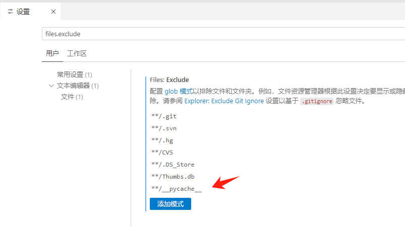

## 前言

这里存放的是我曾经花时间在网络上搜寻的答案

有可能二次搜索，所以记录下来。

## 如何提问题？

[​提问的智慧-中国版](https://mp.weixin.qq.com/s/q461so9lWk4FKJGZ-p7Vcg)

ps:讲一个案例
我在使用油猴的视频播放脚本时，发现当启用脚本后，无法更改视频播放的进度条。原本以为是bug，想要提交到github上作为issue，点开后发现了下面这张图片。

![[Pasted image 20221120124953.png]]

带着好奇心，我点击链接后，也就是上面的链接，仔细阅读==提问的智慧==这篇文章之后，我打算看看如此明显的bug，是否已经有人提过了，但是我发现没有。这让我嗅到了一丝异常，因为bug十分明显，却没有人发现？
于是我打开官方文档，仔细看
![[Pasted image 20221120125233.png]]

幸好看了官方文档，否则这个bug提出去 大概率是STFW or RTFM，/(ㄒoㄒ)/~~

**STFW** , 全名是 <font color="#ff0000">`Search The F**king Web`</font> ， 它还有个弟弟叫 `RTFM`, 全名是 <font color="#ff0000">`Read The F**king manual`</font> 。

## centos


[ 解决CentOS7安装后没有网络](https://blog.csdn.net/qq_42259469/article/details/109309361)

[centos 设置清华源](https://www.cnblogs.com/ahgo/p/16076880.html)

[centos 设置命令行界面自动登录](https://www.codenong.com/cs106447595/)

[对RPM软件包的查询操作](https://blog.csdn.net/yaxuan88521/article/details/122317785)

[【linux】linux系统配置静态IP地址（超详细，手把手教会）](https://blog.csdn.net/u010521062/article/details/114067036)

## ubuntn

[Ubuntu22.04 LTS-Jammy Jellyfish已发布，支持iso镜像下载](https://baijiahao.baidu.com/s?id=1730906316257453037&wfr=spider&for=pc)
[国内镜像地址](https://mirrors.nju.edu.cn/ubuntu-releases/jammy/)

[ubuntu安装docke](https://blog.csdn.net/x7536987/article/details/124808845)


[ubuntu设置清华源](https://mirrors.tuna.tsinghua.edu.cn/help/ubuntu/)

[【ubuntu】系统代理的设置](https://blog.csdn.net/u011119817/article/details/110856212)

## deepin

**qdebug无法打印问题**
<https://blog.csdn.net/qq_43166035/article/details/124085036>

## docker

**docker设置阿里云镜像加速**
<https://www.cnblogs.com/ljjdyz/p/15927994.html>

**使用Docker安装、运行mysql**
<https://www.jianshu.com/p/d9b6bbc7fd77>

下面是不想看网页的简单版本

```bash 
docker run -p 3306:3306 --name mysql -e MYSQL_ROOT_PASSWORD=123456 -d mysql:5.6 
# 解析： 
# -p 3306:3306：将主机的3306端口映射到容器的3306端口 
# --name mysql：给容器命名为mysql 
# -e MYSQL_ROOT_PASSWORD=123456：设置root用户的密码为123456 
# -d：后台运行容器 # mysql:5.6：使用mysql 5.6版本的镜像 
```

**redis安装**
[史上最详细Docker安装Redis （含每一步的图解）实战](https://blog.csdn.net/weixin_45821811/article/details/116211724)

**docker给已有容器追加端口**
https://blog.csdn.net/jamesdodo/article/details/106770830
![[Pasted image 20221125152322.png]]
文章中漏了一点，ports字段中也得添加想要添加的端口，否则无效（我测试时发现的）

## C++/QT

**qmake添加动态库**

[QT开发——动态库/静态库的生成与调用(Qmake和Cmake方式)](https://www.cnblogs.com/zx-hit/p/11977720.html)

**浅析C语言中assert的用法**
<https://www.jb51.net/article/39685.htm>

## MySQL

**MySQL 抓包工具**
[MySQL Sniffer](http://t.zoukankan.com/kevingrace-p-5685476.html)

**mysql怎样查找某个表属于哪个数据库**
<https://blog.csdn.net/qidaihuimou/article/details/123658757>

## git

**git 中文乱码**
<https://www.cnblogs.com/steinven/p/10491262.html>
[Git基础-windows下的git bash 中文乱码解决（git status）_gitbash终端设置utf-8-CSDN博客](https://blog.csdn.net/qq_39505245/article/details/119765952)

**git 头指针分离**
<https://www.jianshu.com/p/91a0f8feb45d>

**git clone最新版本 不需要历史**

简单版本：clone后面添加这个参数代表克隆层级 `--depth 1`

<https://blog.csdn.net/COCO56/article/details/105959190/>


**Git 忽略已存在文件步骤**

1. 移除文件跟踪  
   ```bash
   git rm --cached <文件路径>
   ```

2. 添加文件到 `.gitignore`  
   编辑 `.gitignore` 文件，添加路径，如：  
   ```
   config.json
   logs/*
   *.tmp
   ```

3. 提交更改  
   ```bash
   git add .gitignore
   git commit -m "移除文件并加入忽略列表"
   ```

**注意**：若文件包含敏感信息，建议清理 Git 历史记录。


## 浏览器

[在命令行下为Chromium和Google Chrome浏览器设置代理](https://www.linuxdashen.com/%E5%9C%A8%E5%91%BD%E4%BB%A4%E8%A1%8C%E4%B8%8B%E4%B8%BAchromium%E5%92%8Cgoogle-chrome%E6%B5%8F%E8%A7%88%E5%99%A8%E8%AE%BE%E7%BD%AE%E4%BB%A3%E7%90%86)

## 如何下载B站视频
https://xbeibeix.com/api/bilibili/


## obsidian
### git 插件
在某次重新整理库的时候，照常将 obsidian-pub-config 的内容同步到新库中，但是出现了 git 插件无法使用的现象

[\[Bug\]: Git is not ready · Issue #632 · denolehov/obsidian-git · GitHub](https://github.com/denolehov/obsidian-git/issues/632)

这个 issues 里给了详细的解答，感谢 issues，感谢作者


罪魁祸首是这个插件<font color="#ff0000"> obsidian-local-images-plus</font>  目前在考虑是否继续使用该插件


## vscode
### vscode 配置不同的配置文件，在不同语言或工程下启用不同插件


设置-》配置文件-》新建配置文件


新建配置文件


可以选择复用之前的配置


# VSCode 隐藏 __pycache__ 文件夹 (cursor 同样适用)

引用原文： [VSCode隐藏 __pycache__ 文件夹 - wbytts - 博客园](https://www.cnblogs.com/wbyixx/p/14111822.html)

python在编译时会自动生成 `__pycache__` 文件夹，在IDE目录里显得很多余，以下为如何在VScode里隐藏目录

首先 `Crtl + Shift + P` 打开命令行

输入 setting 找到 Open User Setting 设置

搜索 files.exclude

添加 `**/__pycache__` 即可



# Windows #windows
## windows 截图工具启动默认进入截图模式


苦恼，我不想下载新的截图工具，因为如果需要其他功能，微信自带的截图就很方便，我只想要一个简单的，能够启动就进入截图模式的截图工具，于是搜索了上门的问题

- Windows 10截图工具默认截图后的行为是将截图保存在“C:\Users\用户名\Pictures\Screenshots”文件夹中。
- 用户可以通过快捷键<span style="background:#b1ffff">Win + Print Screen</span>或<span style="background:#b1ffff">Win + Shift + S</span>进行截图。
- 如果使用Win + Shift + S，则截图会显示在通知区域，用户可以编辑并保存，也可以直接拖动到其他应用程序中。

***最终选择使用快捷键 Win+Shift+S***
## windows镜像下载

msdn: <https://next.itellyou.cn/Original/>


